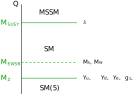
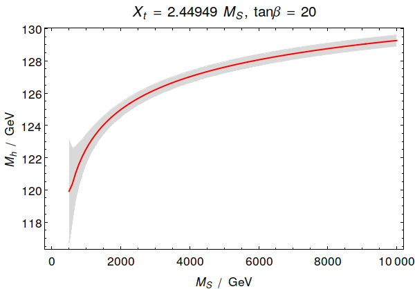

HSSUSY
======

.. contents:: Table of Contents

HSSUSY
------

HSSUSY (high scale supersymmetry) is an implementation of the Standard
Model, matched to the MSSM at the SUSY scale, :math:`M_\text{SUSY}`. The
setup of HSSUSY is shown in the following figure.



Boundary conditions
-------------------

High scale
``````````

In HSSUSY, the ``HighScale`` variable is set to the SUSY scale,
:math:`M_{\text{SUSY}}`.  At this scale the quartic Higgs coupling,
:math:`\lambda(M_\text{SUSY})`, is predicted from the matching to the
MSSM using the full 1-loop and dominant 2- and 3-loop threshold
corrections of :math:`O((\alpha_t + \alpha_b)\alpha_s + (\alpha_t +
\alpha_b)^2 + \alpha_b\alpha_\tau + \alpha_\tau^2 +
\alpha_t\alpha_s^2)` from [1407.4081]_, [1504.05200]_, [1703.08166]_,
[1807.03509]_.

The 3- and partial 4- and 5-loop renormalization group equations of
[1303.4364]_, [1307.3536]_, [1508.00912]_, [1508.02680]_,
[1604.00853]_, [1606.08659]_ are used to run
:math:`\lambda(M_\text{SUSY})` down to the electroweak scale
:math:`M_Z` or :math:`M_{\text{EWSB}}`.

If :math:`M_{\text{SUSY}}` is set to zero, :math:`M_{\text{SUSY}} =
\sqrt{m_{\tilde{t}_1}m_{\tilde{t}_2}}` is used.

Low scale
`````````

The ``LowScale`` is set to :math:`M_Z`.  At this scale, the
:math:`\overline{\text{MS}}` gauge and Yukawa couplings
:math:`g_{1,2,3}(M_Z)`, :math:`Y_{u,d,e}(M_Z)`, as well as the SM
vacuum expectation value (VEV), :math:`v(M_Z)`, are calculated at the
full 1-loop level from the known low-energy couplings
:math:`\alpha_{\text{em}}^{\text{SM(5)}}(M_Z)`,
:math:`\alpha_s^{\text{SM(5)}}(M_Z)`, from the pole masses
:math:`M_Z`, :math:`M_e`, :math:`M_\mu`, :math:`M_\tau`, :math:`M_t`
as well as from the :math:`\overline{\text{MS}}` masses
:math:`m_b^{\text{SM(5)}}(m_b)`, :math:`m_c^{\text{SM(4)}}(m_c)`,
:math:`m_s(2\,\text{GeV})`, :math:`m_d(2\,\text{GeV})`,
:math:`m_u(2\,\text{GeV})`.  In addition to these 1-loop corrections,
known 2-, 3- and 4-loop corrections are taken into account, see the
following table.

=========================== =========================================================
 Coupling                    Corrections
=========================== =========================================================
 :math:`\alpha_{\text{em}}`  1-loop full

 :math:`\sin(\theta_W)`      1-loop full

 :math:`\alpha_{s}`          1-loop full

                             2-loop :math:`O(\alpha_s^2)` [hep-ph:9305305]_ [hep-ph:9707474]_

                             3-loop :math:`O(\alpha_s^3)` [hep-ph:9708255]_

                             4-loop :math:`O(\alpha_s^4)` [hep-ph:0512060]_

 :math:`m_t`                 1-loop full

                             2-loop :math:`O((\alpha_s + \alpha_t)^2)` [hep-ph:9803493]_ [1604.01134]_

                             3-loop :math:`O(\alpha_s^3)` [hep-ph:9911434]_ [hep-ph:9912391]_

                             4-loop :math:`O(\alpha_s^4)` [1604.01134]_

 :math:`m_b`                 1-loop full

 :math:`m_\tau`              1-loop full

 :math:`v`                   1-loop full
=========================== =========================================================

See the documentation of the `SLHA input parameters`_ for a
description of the individual flags to enable/disable higher-order
threshold corrections in FlexibleSUSY.


EWSB scale
``````````

The Higgs and W boson pole masses, :math:`M_h` and :math:`M_Z` are
calculated at the scale :math:`M_{\text{EWSB}}`, which is an input
parameter.  We recommend to set :math:`M_{\text{EWSB}} = M_t`.

Furthermore, the electroweak symmetry breaking condition is imposed at
the scale :math:`M_{\text{EWSB}}` to fix the value of the bililear Higgs
coupling :math:`\mu^2(M_{\text{EWSB}})`.

Pole masses
-----------

The Higgs and W boson pole masses, :math:`M_h` and :math:`M_W`, are
calculated at the full 1-loop level in the Standard Model, including
potential flavour mixing and momentum dependence.  Depending on the
given configuration flags, additional 2-, 3- and 4-loop corrections to
the Higgs pole mass of :math:`O(\alpha_t\alpha_s + \alpha_b\alpha_s)`
[1407.4336]_ :math:`O((\alpha_t + \alpha_b)^2)` [1205.6497]_ and
:math:`O(\alpha_\tau^2)`, as well as 3-loop corrections
:math:`O(\alpha_t^3
+ \alpha_t^2\alpha_s + \alpha_t\alpha_s^2)` [1407.4336]_ and 4-loop
corrections :math:`O(\alpha_t\alpha_s^3)` [1508.00912]_ can be taken
into account.

Input parameters
----------------

HSSUSY takes the following physics parameters as input:

============================================== ======================================================================== ================== ====================
 Parameter                                      Description                                                              SLHA block/field   Mathematica symbol
============================================== ======================================================================== ================== ====================
:math:`M_{\text{SUSY}}`                         SUSY scale                                                               ``EXTPAR[0]``      ``MSUSY``
:math:`M_1(M_\text{SUSY})`                      Bino mass                                                                ``EXTPAR[1]``      ``M1Input``
:math:`M_2(M_\text{SUSY})`                      Wino mass                                                                ``EXTPAR[2]``      ``M2Input``
:math:`M_3(M_\text{SUSY})`                      Gluino mass                                                              ``EXTPAR[3]``      ``M3Input``
:math:`\mu(M_\text{SUSY})`                      :math:`\mu`-parameter                                                    ``EXTPAR[4]``      ``MuInput``
:math:`m_A(M_\text{SUSY})`                      running CP-odd Higgs mass                                                ``EXTPAR[5]``      ``mAInput``
:math:`M_{\text{EWSB}}`                         scale at which the pole mass spectrum is calculated                      ``EXTPAR[6]``      ``MEWSB``
:math:`A_t(M_\text{SUSY})`                      trililear stop coupling                                                  ``EXTPAR[7]``      ``AtInput``
:math:`A_b(M_\text{SUSY})`                      trililear sbottom coupling                                               ``EXTPAR[8]``      ``AbInput``
:math:`A_\tau(M_\text{SUSY})`                   trililear stau coupling                                                  ``EXTPAR[9]``      ``AtauInput``
:math:`\tan\beta(M_\text{SUSY})`                :math:`\tan\beta(M_\text{SUSY})=v_u(M_\text{SUSY})/v_d(M_\text{SUSY})`   ``EXTPAR[25]``     ``TanBeta``
:math:`(m_{\tilde{q}}^2)_{ij}(M_\text{SUSY})`   soft-breaking left-handed squark mass parameters                         ``MSQ2IN``         ``msq2``
:math:`(m_{\tilde{u}}^2)_{ij}(M_\text{SUSY})`   soft-breaking right-handed up-type squark mass parameters                ``MSU2IN``         ``msu2``
:math:`(m_{\tilde{d}}^2)_{ij}(M_\text{SUSY})`   soft-breaking right-handed down-type squark mass parameters              ``MSD2IN``         ``msd2``
:math:`(m_{\tilde{l}}^2)_{ij}(M_\text{SUSY})`   soft-breaking left-handed slepton mass parameters                        ``MSL2IN``         ``msl2``
:math:`(m_{\tilde{e}}^2)_{ij}(M_\text{SUSY})`   soft-breaking right-handed down-type slepton mass parameters             ``MSE2IN``         ``mse2``
============================================== ======================================================================== ================== ====================

The MSSM parameters are defined in the :math:`\overline{\text{DR}}`
scheme at the scale :math:`M_{\text{SUSY}}`.

In addition, HSSUSY defines further input parameters / flags to
enable/disable higher order threshold corrections to the quartic Higgs
coupling :math:`\lambda(M_{\text{SUSY}})` and to estimate the EFT and
SUSY uncertainty:

========================================= ======================================================================================================================================================================== ================== ==================================== ================== ======================
 Parameter                                 Description                                                                                                                                                               Possible values   Recommended value                    SLHA block/field   Mathematica symbol
========================================= ======================================================================================================================================================================== ================== ==================================== ================== ======================
 :math:`n`                                 loop order for :math:`\lambda^{(n)}(M_{\text{SUSY}})`                                                                                                                    0, 1, 2            3                                    ``EXTPAR[100]``    ``LambdaLoopOrder``
 :math:`\Delta_{\alpha_t\alpha_s}`         disable/enable 2-loop corrections to :math:`\lambda(M_{\text{SUSY}})` :math:`O(\alpha_t\alpha_s)`                                                                        0, 1               1                                    ``EXTPAR[101]``    ``TwoLoopAtAs``
 :math:`\Delta_{\alpha_b\alpha_s}`         disable/enable 2-loop corrections to :math:`\lambda(M_{\text{SUSY}})` :math:`O(\alpha_b\alpha_s)`                                                                        0, 1               1                                    ``EXTPAR[102]``    ``TwoLoopAbAs``
 :math:`\Delta_{\alpha_t\alpha_b}`         disable/enable 2-loop corrections to :math:`\lambda(M_{\text{SUSY}})` :math:`O(\alpha_t\alpha_b)`                                                                        0, 1               1                                    ``EXTPAR[103]``    ``TwoLoopAtAb``
 :math:`\Delta_{\alpha_\tau\alpha_\tau}`   disable/enable 2-loop corrections to :math:`\lambda(M_{\text{SUSY}})` :math:`O(\alpha_\tau^2)`                                                                           0, 1               1                                    ``EXTPAR[104]``    ``TwoLoopAtauAtau``
 :math:`\Delta_{\alpha_t\alpha_t}`         disable/enable 2-loop corrections to :math:`\lambda(M_{\text{SUSY}})` :math:`O(\alpha_t^2)`                                                                              0, 1               1                                    ``EXTPAR[105]``    ``TwoLoopAtAt``
 :math:`\Delta_{\text{EFT}}`               disable/enable corrections to :math:`\lambda(M_{\text{SUSY}})` :math:`O(v^2/M_{\text{SUSY}}^2)`                                                                          0, 1               0                                    ``EXTPAR[200]``    ``DeltaEFT``
 :math:`\Delta_{y_t,g_3}`                  disable/enable 3-loop corrections from re-parametrization of :math:`\lambda(M_{\text{SUSY}})` in terms of :math:`y_t^{\text{MSSM}}`, :math:`g_3^{\text{MSSM}}`           0, 1               0                                    ``EXTPAR[201]``    ``DeltaYt``
 :math:`\Delta_{\text{OS}}`                disable/enable conversion of stop masses to on-shell scheme                                                                                                              0, 1               0 (= :math:`\overline{\text{DR}}`)   ``EXTPAR[202]``    ``DeltaOS``
 :math:`Q_\text{match}`                    scale at which :math:`\lambda(Q_\text{match})` is calculated                                                                                                             any real value     0 (= :math:`M_{\text{SUSY}}`)        ``EXTPAR[203]``    ``Qmatch``
 :math:`\delta(\Delta\lambda^{3L})`        add uncertainty :math:`\delta(\Delta\lambda^{3L})` to :math:`\Delta\lambda^{3L}` from Himalaya                                                                           -1, 0, 1           0 (= uncertainty not added)          ``EXTPAR[204]``    ``DeltaLambda3L``
 :math:`\Delta_{\alpha_t\alpha_s^2}`       disable/enable 3-loop corrections to :math:`\lambda(M_{\text{SUSY}})` :math:`O(\alpha_t\alpha_s^2)` from Himalaya                                                        0, 1               1                                    ``EXTPAR[205]``    ``ThreeLoopAtAsAs``
========================================= ======================================================================================================================================================================== ================== ==================================== ================== ======================

Running HSSUSY
--------------

We recommend to run HSSUSY with the following configuration flags: In
an SLHA input file we recommend to use::

    Block FlexibleSUSY
        0   1.0e-05      # precision goal
        1   0            # max. iterations (0 = automatic)
        2   0            # algorithm (0 = all, 1 = two_scale, 2 = semi_analytic)
        3   1            # calculate SM pole masses
        4   4            # pole mass loop order
        5   4            # EWSB loop order
        6   4            # beta-functions loop order
        7   4            # threshold corrections loop order
        8   1            # Higgs 2-loop corrections O(alpha_t alpha_s)
        9   1            # Higgs 2-loop corrections O(alpha_b alpha_s)
       10   1            # Higgs 2-loop corrections O((alpha_t + alpha_b)^2)
       11   1            # Higgs 2-loop corrections O(alpha_tau^2)
       12   0            # force output
       13   3            # Top pole mass QCD corrections (0 = 1L, 1 = 2L, 2 = 3L)
       14   1.0e-11      # beta-function zero threshold
       15   0            # calculate observables (a_muon, ...)
       16   0            # force positive majorana masses
       17   0            # pole mass renormalization scale (0 = SUSY scale)
       18   0            # pole mass renormalization scale in the EFT (0 = min(SUSY scale, Mt))
       19   0            # EFT matching scale (0 = SUSY scale)
       20   2            # EFT loop order for upwards matching
       21   1            # EFT loop order for downwards matching
       22   0            # EFT index of SM-like Higgs in the BSM model
       23   1            # calculate BSM pole masses
       24   124111421    # individual threshold correction loop orders
       25   0            # ren. scheme for Higgs 3L corrections (0 = DR, 1 = MDR)
       26   1            # Higgs 3-loop corrections O(alpha_t alpha_s^2)
       27   1            # Higgs 3-loop corrections O(alpha_b alpha_s^2)
       28   1            # Higgs 3-loop corrections O(alpha_t^2 alpha_s)
       29   1            # Higgs 3-loop corrections O(alpha_t^3)
       30   1            # Higgs 4-loop corrections O(alpha_t alpha_s^3)

In the Mathematica interface we recommend to use::

    handle = FSHSSUSYOpenHandle[
        fsSettings -> {
            precisionGoal -> 1.*^-5,           (* FlexibleSUSY[0] *)
            maxIterations -> 0,                (* FlexibleSUSY[1] *)
            solver -> 0,                       (* FlexibleSUSY[2] *)
            calculateStandardModelMasses -> 1, (* FlexibleSUSY[3] *)
            poleMassLoopOrder -> 4,            (* FlexibleSUSY[4] *)
            ewsbLoopOrder -> 4,                (* FlexibleSUSY[5] *)
            betaFunctionLoopOrder -> 4,        (* FlexibleSUSY[6] *)
            thresholdCorrectionsLoopOrder -> 4,(* FlexibleSUSY[7] *)
            higgs2loopCorrectionAtAs -> 1,     (* FlexibleSUSY[8] *)
            higgs2loopCorrectionAbAs -> 1,     (* FlexibleSUSY[9] *)
            higgs2loopCorrectionAtAt -> 1,     (* FlexibleSUSY[10] *)
            higgs2loopCorrectionAtauAtau -> 1, (* FlexibleSUSY[11] *)
            forceOutput -> 0,                  (* FlexibleSUSY[12] *)
            topPoleQCDCorrections -> 3,        (* FlexibleSUSY[13] *)
            betaZeroThreshold -> 1.*^-11,      (* FlexibleSUSY[14] *)
            forcePositiveMasses -> 0,          (* FlexibleSUSY[16] *)
            poleMassScale -> 0,                (* FlexibleSUSY[17] *)
            eftPoleMassScale -> 0,             (* FlexibleSUSY[18] *)
            eftMatchingScale -> 0,             (* FlexibleSUSY[19] *)
            eftMatchingLoopOrderUp -> 2,       (* FlexibleSUSY[20] *)
            eftMatchingLoopOrderDown -> 1,     (* FlexibleSUSY[21] *)
            eftHiggsIndex -> 0,                (* FlexibleSUSY[22] *)
            calculateBSMMasses -> 1,           (* FlexibleSUSY[23] *)
            thresholdCorrections -> 124111421, (* FlexibleSUSY[24] *)
            higgs3loopCorrectionRenScheme -> 0,(* FlexibleSUSY[25] *)
            higgs3loopCorrectionAtAsAs -> 1,   (* FlexibleSUSY[26] *)
            higgs3loopCorrectionAbAsAs -> 1,   (* FlexibleSUSY[27] *)
            higgs3loopCorrectionAtAtAs -> 1,   (* FlexibleSUSY[28] *)
            higgs3loopCorrectionAtAtAt -> 1,   (* FlexibleSUSY[29] *)
            higgs4loopCorrectionAtAsAsAs -> 1, (* FlexibleSUSY[30] *)
            parameterOutputScale -> 0          (* MODSEL[12] *)
        },
        ...
    ];

In the Section `LibraryLink documentation`_ an example Mathematica
script can be found, which illustrates how to perform a parameter scan
using the HSSUSY model.

Uncertainty estimate of the predicted Higgs pole mass
-----------------------------------------------------

In the file ``model_files/HSSUSY/HSSUSY_uncertainty_estimate.m``
FlexibleSUSY provides the Mathematica function ``CalcHSSUSYDMh[]``,
which calculates the Higgs pole mass at the 3-loop level with HSSUSY
and performs an uncertainty estimate of missing higher order
corrections.  Three main sources of the theory uncertainty are taken
into account:

* **SM uncertainty**: Missing higher order corrections in the
  calculation of the running Standard Model top Yukawa coupling and
  in the calculation of the Higgs pole mass.  The uncertainty from
  this source is estimated by (i) switching on/off the 3-loop QCD
  contributions in the calculation of the running top Yukawa coupling
  :math:`y_t^{\text{SM}}(M_Z)` from the top pole mass and by (ii)
  varying the renormalization scale at which the Higgs pole mass is
  calculated within the interval :math:`[M_{\text{EWSB}}/2, 2
  M_{\text{EWSB}}]`.

* **EFT uncertainty**: Missing terms of :math:`O(v^2/M_{\text{SUSY}}^2)`.
  These missing terms are estimated by adding 1-loop terms of the
  form :math:`v^2/M_{\text{SUSY}}^2` to the quartic Higgs coupling
  :math:`\lambda(M_\text{SUSY})`.

* **SUSY uncertainty**: Missing higher order corrections in the
  calculation of the quartic Higgs coupling
  :math:`\lambda(M_\text{SUSY})`.  This uncertainty is estimated
  by (i) varying the matching scale within the interval
  :math:`[M_{\text{SUSY}}/2, 2 M_{\text{SUSY}}]` and by (ii)
  re-parametrization of :math:`\lambda(M_\text{SUSY})` in terms of
  :math:`y_t^{\text{MSSM}}(M_\text{SUSY})` and
  :math:`g_3^{\text{MSSM}}(M_\text{SUSY})`.

The following code snippet illustrates the calculation of the Higgs
pole mass calculated at the 3-loop level with HSSUSY as a function of
the SUSY scale (red solid line), together with the estimated
uncertainty (grey band).

.. include:: examples/HSSUSY_uncertainty_estimate.m
   :code:

When this script is executed, the following figure is produced:




References
----------

.. _`LibraryLink documentation`: ../librarylink.rst
.. _`SLHA input parameters`: ../slha_input.rst

.. [hep-ph:9305305] `Phys.Lett. B313 (1993) 441-446 <https://inspirehep.net/record/354674>`_ [`arXiv:hep-ph/9305305 <https://arxiv.org/abs/hep-ph/9305305>`_]
.. [hep-ph:9707474] `Phys.Lett. B424 (1998) 367-374 <https://inspirehep.net/record/446409>`_ [`arXiv:hep-ph/9707474 <https://arxiv.org/abs/hep-ph/9707474>`_]
.. [hep-ph:9708255] `Nucl.Phys. B510 (1998) 61-87 <https://inspirehep.net/record/446802>`_ [`arXiv:hep-ph/9708255 <https://arxiv.org/abs/hep-ph/9708255>`_]
.. [hep-ph:9803493] `Nucl.Phys. B539 (1999) 671-690 <https://inspirehep.net/record/468752>`_ [`arXiv:hep-ph/9803493 <https://arxiv.org/abs/hep-ph/9803493>`_]
.. [hep-ph:9911434] `Nucl.Phys. B573 (2000) 617-651 <https://inspirehep.net/record/510551>`_ [`arXiv:hep-ph/9911434 <https://arxiv.org/abs/hep-ph/9911434>`_]
.. [hep-ph:9912391] `Phys.Lett. B482 (2000) 99-108 <https://inspirehep.net/record/522686>`_ [`arXiv:hep-ph/9912391 <https://arxiv.org/abs/hep-ph/9912391>`_]
.. [hep-ph:0004189] `Comput.Phys.Commun. 133 (2000) 43-65 <https://inspirehep.net/record/526362>`_ [`arXiv:hep-ph/0004189 <https://arxiv.org/abs/hep-ph/0004189>`_]
.. [hep-ph:0105096] `Nucl.Phys. B611 (2001) 403-422 <https://inspirehep.net/record/556417>`_ [`arXiv:hep-ph/0105096 <https://arxiv.org/abs/hep-ph/0105096>`_]
.. [hep-ph:0210258] `Eur.Phys.J. C29 (2003) 87-101 <https://inspirehep.net/record/600038>`_ [`arXiv:hep-ph/0210258 <https://arxiv.org/abs/hep-ph/0210258>`_]
.. [hep-ph:0308231] `Phys.Lett. B579 (2004) 180-188 <https://inspirehep.net/record/626390>`_ [`arXiv:hep-ph/0308231 <https://arxiv.org/abs/hep-ph/0308231>`_]
.. [hep-ph:0507139] `Phys.Atom.Nucl. 71 (2008) 343-350 <https://inspirehep.net/record/687205>`_ [`arXiv:hep-ph/0507139 <https://arxiv.org/abs/hep-ph/0507139>`_]
.. [hep-ph:0509048] `Phys.Rev. D72 (2005) 095009 <https://inspirehep.net/record/691479>`_ [`arXiv:hep-ph/0509048 <https://arxiv.org/abs/hep-ph/0509048>`_]
.. [hep-ph:0512060] `Nucl.Phys. B744 (2006) 121-135 <https://inspirehep.net/record/699609>`_ [`arXiv:hep-ph/0512060 <https://arxiv.org/abs/hep-ph/0512060>`_]
.. [0707.0650] `Int.J.Mod.Phys. A22 (2007) 5245-5277 <https://inspirehep.net/record/755029>`_ [`arXiv:0707.0650 <https://arxiv.org/abs/0707.0650>`_]
.. [0810.5101] `JHEP 0902 (2009) 037 <https://inspirehep.net/record/800842>`_ [`arXiv:0810.5101 <https://arxiv.org/abs/0810.5101>`_]
.. [0901.2065] `Phys.Rev. D84 (2011) 034030 <https://inspirehep.net/record/811006>`_ [`arXiv:0901.2065 <https://arxiv.org/abs/0901.2065>`_]
.. [1009.5455] `C10-06-06.1 <https://inspirehep.net/record/871111>`_ [`arXiv:1009.5455 <https://arxiv.org/abs/1009.5455>`_]
.. [1205.6497] `JHEP 1208 (2012) 098 <https://inspirehep.net/record/1116539>`_ [`arXiv:1205.6497 <https://arxiv.org/abs/1205.6497>`_]
.. [1303.4364] `Nucl.Phys. B875 (2013) 552-565 <https://inspirehep.net/record/1224266>`_ [`arXiv:1303.4364 <https://arxiv.org/abs/1303.4364>`_]
.. [1307.3536] `JHEP 1312 (2013) 089 <https://inspirehep.net/record/1242456>`_ [`arXiv:1307.3536 <https://arxiv.org/abs/1307.3536>`_]
.. [1407.4081] `JHEP 1409 (2014) 092 <https://inspirehep.net/record/1306517>`_ [`arXiv:1407.4081 <https://arxiv.org/abs/1407.4081>`_]
.. [1407.4336] `Phys.Rev. D90 (2014) no.7, 073010 <https://inspirehep.net/record/1306632>`_ [`arXiv:1407.4336 <https://arxiv.org/abs/1407.4336>`_]
.. [1504.05200] `JHEP 1507 (2015) 159 <https://inspirehep.net/record/1362483>`_ [`arXiv:1504.05200 <https://arxiv.org/abs/1504.05200>`_]
.. [1508.00912] `Phys.Rev. D92 (2015) no.5, 054029 <https://inspirehep.net/record/1386688>`_ [`arXiv:1508.00912 <https://arxiv.org/abs/1508.00912>`_]
.. [1508.02680] `Phys.Lett. B762 (2016) 151-156 <https://inspirehep.net/record/1387530>`_ [`arXiv:1508.02680 <https://arxiv.org/abs/1508.02680>`_]
.. [1604.00853] `JHEP 1606 (2016) 175 <https://inspirehep.net/record/1441223>`_ [`arXiv:1604.00853 <https://arxiv.org/abs/1604.00853>`_]
.. [1606.08659] `Phys.Rev.Lett. 118 (2017) no.8, 082002 <https://inspirehep.net/record/1472834>`_ [`arXiv:1606.08659 <https://arxiv.org/abs/1606.08659>`_]
.. [1604.01134] `Phys.Rev. D93 (2016) no.9, 094017 <https://inspirehep.net/record/1442368>`_ [`arXiv:1604.01134 <https://arxiv.org/abs/1604.01134>`_]
.. [1703.08166] `Eur.Phys.J. C77 (2017) no.5, 334 <https://inspirehep.net/record/1518961>`_ [`arXiv:1703.08166 <https://arxiv.org/abs/1703.08166>`_]
.. [1807.03509] `Eur.Phys.J. C78 (2018) no.10, 874 <https://inspirehep.net/record/1681658>`_ [`arXiv:1807.03509 <https://arxiv.org/abs/1807.03509>`_]
