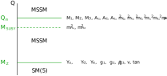
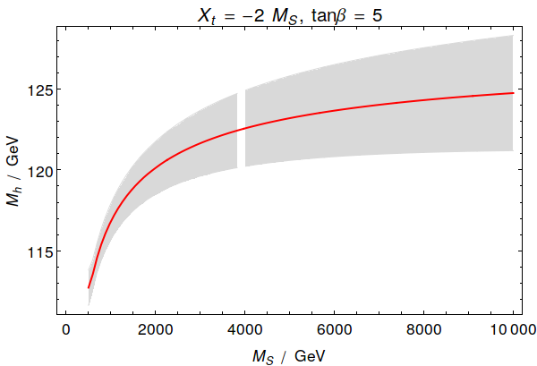

NUHMSSMNoFVHimalaya
===================

.. contents:: Table of Contents

NUHMSSMNoFVHimalaya
-------------------

NUHMSSMNoFVHimalaya (non-universal Higgs MSSM without flavour
violation + Himalaya) is an implementation of the MSSM without flavour
violation.  The `Himalaya library`_ [1708.05720]_ is linked to this
model to include 3-loop corrections of :math:`O(\alpha_t\alpha_s^2)`
[0803.0672]_, [1005.5709]_ to the light CP-even Higgs pole mass.  The
setup of NUHMSSMNoFVHimalaya is shown in the following figure.

Building the NUHMSSMNoFVHimalaya
--------------------------------

In order to use the 3-loop contributions to the light CP-even Higgs
mass from the `Himalaya library`_, the NUHMSSMNoFVHimalaya must be
configured with the ``--enable-himalaya`` flag::

    ./createmodel --name=NUHMSSMNoFVHimalaya
    ./configure --with-models=NUHMSSMNoFVHimalaya \
        --enable-himalaya \
        --with-himalaya-incdir=${HIMALAYA_DIR}/source/include \
        --with-himalaya-libdir=${HIMALAYA_DIR}/build
    make

In the above example ``HIMALAYA_DIR`` is the path to the Himalaya
directory.

Input parameters
----------------

NUHMSSMNoFVHimalaya takes the following physics parameters as input:

============================================== ============================================================================ ================== ====================
 Parameter                                      Description                                                                  SLHA block/field   Mathematica symbol
============================================== ============================================================================ ================== ====================
:math:`Q_{\text{in}}`                           input scale                                                                  ``EXTPAR[0]``      ``Qin``
:math:`M_1(M_\text{SUSY})`                      Bino mass                                                                    ``EXTPAR[1]``      ``M1``
:math:`M_2(M_\text{SUSY})`                      Wino mass                                                                    ``EXTPAR[2]``      ``M2``
:math:`M_3(M_\text{SUSY})`                      Gluino mass                                                                  ``EXTPAR[3]``      ``M3``
:math:`A_t(M_\text{SUSY})`                      trililear stop coupling                                                      ``EXTPAR[11]``     ``AtIN``
:math:`A_b(M_\text{SUSY})`                      trililear sbottom coupling                                                   ``EXTPAR[12]``     ``AbIN``
:math:`A_\tau(M_\text{SUSY})`                   trililear stau coupling                                                      ``EXTPAR[13]``     ``AtauIN``
:math:`A_c(M_\text{SUSY})`                      trililear scharm coupling                                                    ``EXTPAR[14]``     ``AcIN``
:math:`A_s(M_\text{SUSY})`                      trililear sstrange coupling                                                  ``EXTPAR[15]``     ``AsIN``
:math:`A_\mu(M_\text{SUSY})`                    trililear smuon coupling                                                     ``EXTPAR[16]``     ``AmuonIN``
:math:`A_u(M_\text{SUSY})`                      trililear sup coupling                                                       ``EXTPAR[17]``     ``AuIN``
:math:`A_d(M_\text{SUSY})`                      trililear sdown coupling                                                     ``EXTPAR[18]``     ``AdIN``
:math:`A_e(M_\text{SUSY})`                      trililear selectron coupling                                                 ``EXTPAR[19]``     ``AeIN``
:math:`\mu(M_\text{SUSY})`                      :math:`\mu`-parameter                                                        ``EXTPAR[23]``     ``MuIN``
:math:`m_A^2(M_\text{SUSY})`                    running CP-odd Higgs mass                                                    ``EXTPAR[24]``     ``mA2IN``
:math:`(m_{\tilde{l}}^2)_{11}(M_\text{SUSY})`   soft-breaking 1st generation left-handed slepton mass parameters             ``EXTPAR[31]``     ``ml11IN``
:math:`(m_{\tilde{l}}^2)_{22}(M_\text{SUSY})`   soft-breaking 2nd generation left-handed slepton mass parameters             ``EXTPAR[32]``     ``ml22IN``
:math:`(m_{\tilde{l}}^2)_{33}(M_\text{SUSY})`   soft-breaking 3rd generation left-handed slepton mass parameters             ``EXTPAR[33]``     ``ml33IN``
:math:`(m_{\tilde{e}}^2)_{11}(M_\text{SUSY})`   soft-breaking 1st generation right-handed slepton mass parameters            ``EXTPAR[34]``     ``me11IN``
:math:`(m_{\tilde{e}}^2)_{22}(M_\text{SUSY})`   soft-breaking 2nd generation right-handed slepton mass parameters            ``EXTPAR[35]``     ``me22IN``
:math:`(m_{\tilde{e}}^2)_{33}(M_\text{SUSY})`   soft-breaking 3rd generation right-handed slepton mass parameters            ``EXTPAR[36]``     ``me33IN``
:math:`(m_{\tilde{q}}^2)_{11}(M_\text{SUSY})`   soft-breaking 1st generation left-handed squark mass parameters              ``EXTPAR[41]``     ``mq11IN``
:math:`(m_{\tilde{q}}^2)_{22}(M_\text{SUSY})`   soft-breaking 2nd generation left-handed squark mass parameters              ``EXTPAR[42]``     ``mq22IN``
:math:`(m_{\tilde{q}}^2)_{33}(M_\text{SUSY})`   soft-breaking 3rd generation left-handed squark mass parameters              ``EXTPAR[43]``     ``mq33IN``
:math:`(m_{\tilde{u}}^2)_{11}(M_\text{SUSY})`   soft-breaking 1st generation right-handed up-type squark mass parameters     ``EXTPAR[44]``     ``mu11IN``
:math:`(m_{\tilde{u}}^2)_{22}(M_\text{SUSY})`   soft-breaking 2nd generation right-handed up-type squark mass parameters     ``EXTPAR[45]``     ``mu22IN``
:math:`(m_{\tilde{u}}^2)_{33}(M_\text{SUSY})`   soft-breaking 3rd generation right-handed up-type squark mass parameters     ``EXTPAR[46]``     ``mu33IN``
:math:`(m_{\tilde{d}}^2)_{11}(M_\text{SUSY})`   soft-breaking 1st generation right-handed down-type squark mass parameters   ``EXTPAR[47]``     ``md11IN``
:math:`(m_{\tilde{d}}^2)_{22}(M_\text{SUSY})`   soft-breaking 2nd generation right-handed down-type squark mass parameters   ``EXTPAR[48]``     ``md22IN``
:math:`(m_{\tilde{d}}^2)_{33}(M_\text{SUSY})`   soft-breaking 3rd generation right-handed down-type squark mass parameters   ``EXTPAR[49]``     ``md33IN``
:math:`M_\text{low}`                            scale where the SM(5) is matched to the MSSM                                 ``EXTPAR[100]``    ``Mlow``
:math:`\tan\beta(M_Z)`                          :math:`\tan\beta(M_Z)=v_u(M_Z)/v_d(M_Z)`                                     ``MINPAR[3]``      ``TanBeta``
============================================== ============================================================================ ================== ====================

All MSSM parameters, except for :math:`\tan\beta`, are defined in the
:math:`\overline{\text{DR}}` scheme at the scale :math:`M_{\text{SUSY}}`.
:math:`\tan\beta` is defined in the :math:`\overline{\text{DR}}` scheme at
the scale :math:`M_Z`.

Running the NUHMSSMNoFVHimalaya
-------------------------------

We recommend to run NUHMSSMNoFVHimalaya with the following
configuration flags: In an SLHA input file we recommend to use::

    Block FlexibleSUSY
        0   1.0e-05      # precision goal
        1   0            # max. iterations (0 = automatic)
        2   0            # algorithm (0 = all, 1 = two_scale, 2 = semi_analytic)
        3   0            # calculate SM pole masses
        4   3            # pole mass loop order
        5   3            # EWSB loop order
        6   3            # beta-functions loop order
        7   2            # threshold corrections loop order
        8   1            # Higgs 2-loop corrections O(alpha_t alpha_s)
        9   1            # Higgs 2-loop corrections O(alpha_b alpha_s)
       10   1            # Higgs 2-loop corrections O(alpha_t^2 + alpha_t alpha_b + alpha_b^2)
       11   1            # Higgs 2-loop corrections O(alpha_tau^2)
       12   0            # force output
       13   1            # Top pole mass QCD corrections (0 = 1L, 1 = 2L, 2 = 3L)
       14   1.0e-11      # beta-function zero threshold
       15   0            # calculate observables (a_muon, ...)
       16   0            # force positive majorana masses
       17   0            # pole mass renormalization scale (0 = SUSY scale)
       18   0            # pole mass renormalization scale in the EFT (0 = min(SUSY scale, Mt))
       19   0            # EFT matching scale (0 = SUSY scale)
       20   2            # EFT loop order for upwards matching
       21   1            # EFT loop order for downwards matching
       22   0            # EFT index of SM-like Higgs in the BSM model
       23   1            # calculate BSM pole masses
       24   122111221    # individual threshold correction loop orders
       25   0            # ren. scheme for Higgs 3L corrections (0 = DR, 1 = MDR)
       26   1            # Higgs 3-loop corrections O(alpha_t alpha_s^2)
       27   1            # Higgs 3-loop corrections O(alpha_b alpha_s^2)
       28   1            # Higgs 3-loop corrections O(alpha_t^2 alpha_s)
       29   1            # Higgs 3-loop corrections O(alpha_t^3)
       30   1            # Higgs 4-loop corrections O(alpha_t alpha_s^3)

In the Mathematica interface we recommend to use::

    handle = FSNUHMSSMNoFVHimalayaOpenHandle[
        fsSettings -> {
            precisionGoal -> 1.*^-5,           (* FlexibleSUSY[0] *)
            maxIterations -> 0,                (* FlexibleSUSY[1] *)
            solver -> 0,                       (* FlexibleSUSY[2] *)
            calculateStandardModelMasses -> 0, (* FlexibleSUSY[3] *)
            poleMassLoopOrder -> 3,            (* FlexibleSUSY[4] *)
            ewsbLoopOrder -> 3,                (* FlexibleSUSY[5] *)
            betaFunctionLoopOrder -> 3,        (* FlexibleSUSY[6] *)
            thresholdCorrectionsLoopOrder -> 2,(* FlexibleSUSY[7] *)
            higgs2loopCorrectionAtAs -> 1,     (* FlexibleSUSY[8] *)
            higgs2loopCorrectionAbAs -> 1,     (* FlexibleSUSY[9] *)
            higgs2loopCorrectionAtAt -> 1,     (* FlexibleSUSY[10] *)
            higgs2loopCorrectionAtauAtau -> 1, (* FlexibleSUSY[11] *)
            forceOutput -> 0,                  (* FlexibleSUSY[12] *)
            topPoleQCDCorrections -> 1,        (* FlexibleSUSY[13] *)
            betaZeroThreshold -> 1.*^-11,      (* FlexibleSUSY[14] *)
            forcePositiveMasses -> 0,          (* FlexibleSUSY[16] *)
            poleMassScale -> 0,                (* FlexibleSUSY[17] *)
            eftPoleMassScale -> 0,             (* FlexibleSUSY[18] *)
            eftMatchingScale -> 0,             (* FlexibleSUSY[19] *)
            eftMatchingLoopOrderUp -> 2,       (* FlexibleSUSY[20] *)
            eftMatchingLoopOrderDown -> 1,     (* FlexibleSUSY[21] *)
            eftHiggsIndex -> 0,                (* FlexibleSUSY[22] *)
            calculateBSMMasses -> 1,           (* FlexibleSUSY[23] *)
            thresholdCorrections -> 122111221, (* FlexibleSUSY[24] *)
            higgs3loopCorrectionRenScheme -> 0,(* FlexibleSUSY[25] *)
            higgs3loopCorrectionAtAsAs -> 1,   (* FlexibleSUSY[26] *)
            higgs3loopCorrectionAbAsAs -> 1,   (* FlexibleSUSY[27] *)
            higgs3loopCorrectionAtAtAs -> 1,   (* FlexibleSUSY[28] *)
            higgs3loopCorrectionAtAtAt -> 1,   (* FlexibleSUSY[29] *)
            higgs4loopCorrectionAtAsAsAs -> 1, (* FlexibleSUSY[30] *)
            parameterOutputScale -> 0          (* MODSEL[12] *)
        },
        ...
    ];

Uncertainty estimate of the predicted Higgs pole mass
-----------------------------------------------------

In the file
``model_files/NUHMSSMNoFVHimalaya/NUHMSSMNoFVHimalaya_uncertainty_estimate.m``
FlexibleSUSY provides the Mathematica function
``CalcNUHMSSMNoFVHimalayaDMh[]``, which calculates the Higgs pole mass
at the 3-loop level with NUHMSSMNoFVHimalaya and performs an
uncertainty estimate of missing higher order corrections.  Three
sources of the theory uncertainty are taken into account:

 - **missing higher order contributions to the Higgs mass**: The Higgs
   pole mass is calculated at the SUSY scale, :math:`M_\text{SUSY}`, as
   a function of the running MSSM :math:`\overline{\text{DR}}`
   parameters at full 1-loop level plus 2-loop corrections of
   :math:`O((\alpha_t + \alpha_b)\alpha_s + (\alpha_t + \alpha_b)^2 +
   \alpha_\tau^2)` plus 3-loop corrections of :math:`O((\alpha_t +
   \alpha_b)\alpha_s^2)`.  The missing contributions are estimated
   by varying the scale within the interval :math:`[M_{\text{SUSY}}/2, 2
   M_{\text{SUSY}}]`.

 - **missing higher order contributions to the strong gauge coupling**:
   The running MSSM :math:`\overline{\text{DR}}` strong gauge coupling
   :math:`g_3(M_Z)` is calculated at the full 1-loop level plus 2-loop
   contributions of :math:`O(\alpha_s^2 + (\alpha_t +
   \alpha_b)\alpha_s)`.

   If the Higgs mass is calculated at the 3-loop level, then missing
   4-loop strong corrections to :math:`M_h` are estimated by switching
   on/off the 2-loop contributions to :math:`g_3(M_Z)`.

 - **missing higher order contributions to the top Yukawa coupling**:
   The running MSSM :math:`\overline{\text{DR}}` Yukawa coupling,
   :math:`y_t(M_Z)`, is calculated at the full 1-loop level plus 2-loop
   contributions of :math:`O(\alpha_s^2)`.

   If the Higgs mass is calculated at the 2-loop level, then missing
   3-loop top Yukawa-type corrections to :math:`M_h` are estimated by
   switching on/off the 2-loop contributions to :math:`y_t(M_Z)`.

   If the Higgs mass is calculated at the 3-loop level, then missing
   4-loop top Yukawa-type corrections can currently not be estimated
   by switching on/off potential 3-loop contributions to
   :math:`y_t(M_Z)`, because the latter are currently unknown.

The following code snippet illustrates the calculation of the Higgs
pole mass at the 3-loop level with NUHMSSMNoFVHimalaya as a function
of the SUSY scale (red solid line), together with the estimated
uncertainty (grey band).

.. include:: examples/NUHMSSMNoFVHimalaya_uncertainty_estimate.m
   :code:

When this script is executed, the following figure is produced:

References
----------

.. _`Himalaya library`: https://github.com/Himalaya-Library/Himalaya

.. [0803.0672] `Phys.Rev.Lett. 100 (2008) 191602, Phys.Rev.Lett. 101 (2008) 039901 <https://inspirehep.net/record/780752>`_ [`arXiv:0803.0672 <https://arxiv.org/abs/0803.0672>`_]
.. [1005.5709] `JHEP 1008 (2010) 104 <https://inspirehep.net/record/856612>`_ [`arXiv:1005.5709 <https://arxiv.org/abs/1005.5709>`_]
.. [1708.05720] `Eur.Phys.J. C77 (2017) no.12, 814 <https://inspirehep.net/record/1617767>`_ [`arXiv:1708.05720 <https://arxiv.org/abs/1708.05720>`_]
